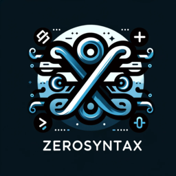

# ZeroSyntax v2

<p align="center">
  
</p>

[](https://github.com/ViTeXFTW/ZeroSyntaxV2/actions/workflows/ci.yml)
[](https://github.com/ViTeXFTW/ZeroSyntaxV2/actions/workflows/release.yml)
[](LICENSE)

ZeroSyntax v2 is a language server and VS Code extension for the INI files used by
*Command & Conquer: Generals - Zero Hour*. It gives modders and map authors
editor support for the game's object, weapon, upgrade, FX, audio, module, and
map override definitions.

The project is built around an IDE-agnostic Language Server Protocol (LSP)
binary, `zerosyntax-lsp`, plus a reference VS Code extension. The analyzer uses a
hand-maintained schema modeled on the game's INI parsing tables, so diagnostics
and completions follow the structure the engine actually expects instead of
treating the files as generic INI.

## Features

- Diagnostics for unknown blocks, fields, modules, invalid values,
  unterminated blocks, unresolved references, duplicate module tags, and
  unreachable upgrade-conditioned sets.
- Context-aware completions for block names, field names, module slots, module
  types, enum values, bitflags, and workspace definitions.
- Hover, go to definition, find references, rename, workspace symbol search,
  document symbols, and folding ranges.
- Semantic highlighting for Generals INI syntax and schema-aware tokens.
- Quick fixes for common issues such as missing `End` statements, misspelled
  enum values, unresolved references, and suppressing diagnostics.
- Optional formatter for indentation normalization.
- Incremental document updates and cached diagnostics for large game files.
- Reference VS Code extension with bundled syntax highlighting and LSP client
  integration.

## Supported platforms

Release assets are built for Windows x64 and Linux x64. Other platforms can
build from source with Rust and Node.js.

## Getting Started

Install the latest platform-specific VS Code extension package from
[GitHub Releases](https://github.com/ViTeXFTW/ZeroSyntaxV2/releases), then open a
Zero Hour `.ini` file. The extension activates for the `generals-ini` language
and starts the bundled language server automatically.

Formatting is off by default. Enable it with `zerosyntax.format.enable` when you
want the server to advertise document formatting to VS Code.

For map/solo.ini diagnostics and W3D model/bone completions, set
`zerosyntax.baseIniRoots` to game or mod directories and/or `.big` archives.
INI definitions are treated as already loaded before the map file; W3D assets
are indexed for model and bone checks.

### Standalone language server

Release assets also include the standalone `zerosyntax-lsp` binary. Any editor
with generic LSP support can run that binary over stdio for `.ini` files. Pass
these initialization options if you want formatting or base INI roots:

```json
{
  "format": { "enable": true },
  "baseIniRoots": ["C:/Games/Zero Hour", "C:/Mods/MyMod/Data/INI", "C:/Mods/MyMod.big"]
}
```

## Development

```sh
cargo test --locked
cargo fmt --all --check
cargo clippy --locked --all-targets --all-features -- -D warnings

cd editors/vscode
npm ci
npm run compile
```

The optional `GeneralsCode/`, `corpus/`, and `examples/` directories are local
inputs only and are intentionally not committed. Generated binaries,
`node_modules`, compiled extension output, and `.vsix` packages are also ignored.

See [CONTRIBUTING.md](CONTRIBUTING.md) for pull request guidance and
[docs/release.md](docs/release.md) for the release process.

## Common Editor Setup

### Neovim

```lua
local configs = require("lspconfig.configs")
local lspconfig = require("lspconfig")

if not configs.zerosyntax then
  configs.zerosyntax = {
    default_config = {
      cmd = { "zerosyntax-lsp" },
      filetypes = { "generals_ini" },
      root_dir = lspconfig.util.root_pattern(".git", "*.ini"),
      single_file_support = true,
      init_options = {
        format = { enable = false },
        baseIniRoots = { "C:/Games/Zero Hour" },
      },
    },
  }
end

lspconfig.zerosyntax.setup({})
```

## Diagnostic Suppression

Suppress a diagnostic for one file with a file-scope comment:

```ini
; zerosyntax-disable: unresolved-reference, unreachable-set
```

Use the diagnostic code shown by your editor. Multiple codes can be separated by
spaces or commas, and multiple pragma lines accumulate. Unknown suppression codes
are reported so typos do not silently hide problems. The old
`; zerosyntax-disable:` spelling remains supported for existing files.

## Feature Showcase

### Diagnostic codes

ZeroSyntax v2 reports stable diagnostic codes so warnings can be searched,
suppressed, or tracked consistently:

| Code | Meaning |
| --- | --- |
| `syntax` | The file cannot be parsed cleanly, such as a missing `End`. |
| `stray-field` | A field appears outside a valid block or module. |
| `unknown-block` | A top-level block name is not known to the Generals INI schema. |
| `overrides` | A map override redefines an existing object-style definition. |
| `duplicate-definition` | The same definition is declared more than once. |
| `unreachable-set` | A `WeaponSet` or `ArmorSet` uses upgrade conditions without the trigger module needed to activate it. |
| `unknown-field` | A field is not valid in the current block or module. |
| `missing-module-tag` | A module is missing its required `ModuleTag_*` name. |
| `unknown-module` | A module type is not known for the current module slot. |
| `missing-condition` | A conditional state block is missing its condition token. |
| `missing-value` | A field requires a value but none was provided. |
| `bad-bool` | A boolean field is not `Yes` or `No`. |
| `non-positive` | A value must be greater than zero. |
| `bad-percent` | A percentage value is malformed or out of range. |
| `bad-color` | A color value is malformed. |
| `bad-coord` | A coordinate value is malformed. |
| `bad-number` | A numeric field does not contain a valid number. |
| `bad-enum` | A value is not a member of the expected enum set. |
| `bad-flag` | A bitflag value is not a member of the expected flag set. |
| `unresolved-reference` | A field references a definition that is not found in the workspace. |
| `unknown-suppression` | A `zerosyntax-disable` comment names a code that does not exist. |
| `module-wrong-slot` | A module type is used under the wrong slot. |
| `duplicate-module-tag` | Two modules in the same object use the same module tag. |
| `editor-default-module` | A placeholder/default module value should be replaced before shipping. |

### Quick fixes

Supported quick fixes appear in the editor's lightbulb/code action menu:

| Quick fix | When it appears |
| --- | --- |
| Insert missing `End` | A block or module is unterminated. |
| Replace with `<value>` | An enum or bitflag value is close to a known valid value. |
| Create stub `<Block> <Name>` | A reference points to a missing definition that can be scaffolded safely. |
| Remove unreachable `WeaponSet` / `ArmorSet` | An upgrade-conditioned set can never activate. |
| Insert `WeaponSetUpgrade` / `ArmorUpgrade` trigger module | An object has an unreachable upgrade-conditioned set and needs a trigger module. |
| Suppress `<code>` in this file | A warning or hint is intentional for the current file. |

### Example

```ini
; zerosyntax-disable: unresolved-reference

Weapon DemoCannon
  PrimaryDamage = lots        ; bad-number
  DeathType = EXPLODDED       ; quick fix: Replace with `EXPLODED`
  FireFX = DemoMissingFX      ; suppressed unresolved-reference
End

Object DemoTank
  Behavior = PhysicsBehavior ModuleTag_01
  End

  WeaponSet
    Conditions = PLAYER_UPGRADE
    Weapon = PRIMARY DemoCannon
  End                         ; unreachable-set
End
```

In this example, ZeroSyntax v2 can flag the invalid number, suggest the corrected
death flag, suppress the intentionally missing FX reference, and offer either to
remove the unreachable `WeaponSet` or insert the matching trigger module.

## License

ZeroSyntax v2 is licensed under the MIT License. See [LICENSE](LICENSE).

ZeroSyntax v2 is an unofficial community project and is not affiliated with,
endorsed by, or sponsored by Electronic Arts. Command & Conquer and related
names are trademarks of their respective owners.
